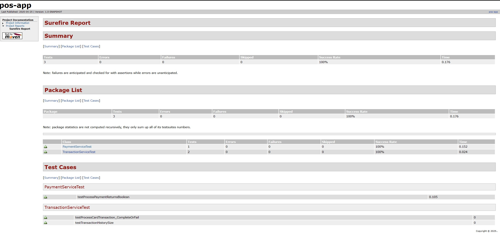
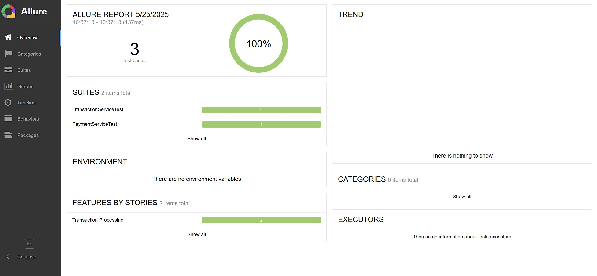

# Point-of-Sale System (GitHub Actions CI)


This repository contains the **Point-of-Sale System** developed as part of the CSC-449 Java Software Engineering course at National University. The project is implemented in Java, built with Maven, and features integrated automated testing and reporting through GitHub Actions, Surefire, and Allure.

---

## 📦 Project Features

- Java-based terminal + GUI **Point-of-Sale System**
- Object-Oriented Design (OOP) practices
- Unit testing using **JUnit 5**
- Test automation via **GitHub Actions**
- HTML test reports generated via:
  - 🧪 Maven Surefire
  - 📊 Allure Reporting Framework

---

## 📁 Project Folder Structure

```groovy
CSC-449-Java-NU-Spring-2025/
├── .github/
│ └── workflows/
│ └── pos-test-ci.yml
├── src/
│ ├── main/
│ │ └── java/
│ │ ├── AuthService.java
│ │ ├── Cart.java
│ │ ├── CartItem.java
│ │ ├── CartManager.java
│ │ ├── Main.java
│ │ ├── PaymentMethod.java
│ │ ├── PaymentService.java
│ │ ├── POSWindow.java
│ │ ├── Product.java
│ │ ├── ReceiptPrinter.java
│ │ ├── Role.java
│ │ ├── Transaction.java
│ │ ├── TransactionService.java
│ │ └── User.java
│ └── test/
│ │ └── java/
│ │ ├── PaymentServiceTest.java
│ │ ├── TransactionServiceTest.java
├── target/
│ ├── surefire-reports/
│ ├── site/
│ │ ├── surefire-report.html
│ │ └── allure-maven-plugin/
│ │ └── index.html
│ └── allure-results/
├── Screenshots/
│ ├── surefire-report.jpg
│ └── allure-report.jpg
├── README.md
├── LICENSE.txt
├── CONTRIBUTING.md
├── CODE_OF_CONDUCT.md
├── pom.xml
```

This structure follows **Maven** conventions and includes **GitHub Actions** and test reporting integrations.

---

## 🚀 Getting Started

1. **Clone the repo:**

    ```bash
    git clone https://github.com/bjett4409/CSC-449-Java-NU-Spring-2025.git
    cd CSC-449-Java-NU-Spring-2025
    git checkout pos-test-ci
    ```

2. **Run Tests and Generate Reports:**

    ```bash
    mvn clean test site allure:report
    ```

- Surefire Report → `target/site/surefire-report.html`
- Allure Report → `target/site/allure-maven-plugin/index.html`

---

## GitHub Actions CI Workflow

GitHub Actions automatically builds, tests, and generates both reports on every push to the `pos-test-ci` branch.

**CI Steps Overview:**

- ✅ Checkout repository
- ☕ Set up Java 21 (Temurin)
- 📦 Install Allure CLI via Node
- 🧪 Run `mvn clean test site allure:report`
- 📤 Upload:
  - Surefire HTML Report
  - Allure HTML Report
- 🛰️ Optional: Deploy Allure report to GitHub Pages (coming soon)

  - 🔗 CI Workflow File: [pos-test-ci.yml](.github/workflows/pos-test-ci.yml)
  - 🔗 Latest Workflow Runs: [bjett4409/CSC-449-Java-NU-Spring-2025/actions](https://github.com/bjett4409/CSC-449-Java-NU-Spring-2025/actions)

---

## 🧪 Test Reports

- ✅ Surefire HTML Report
Found at: `target/site/surefire-report.html`


- ✅ Allure HTML Report
Found at: `target/allure-results/index.html`


---

## 📄 License

This project is licensed under the terms of the [MIT License](LICENSE.txt).

---

👥 Contributors

- **Author:** Brandon Jett
- **Team Members:** Laurence Smith and Alejandro Alatorre
- **Professor:** Dr. Pradip Peter Dey, Ph.D.

---
