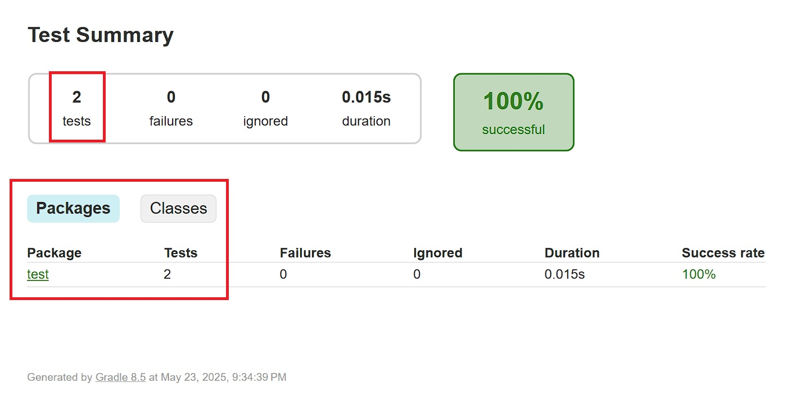
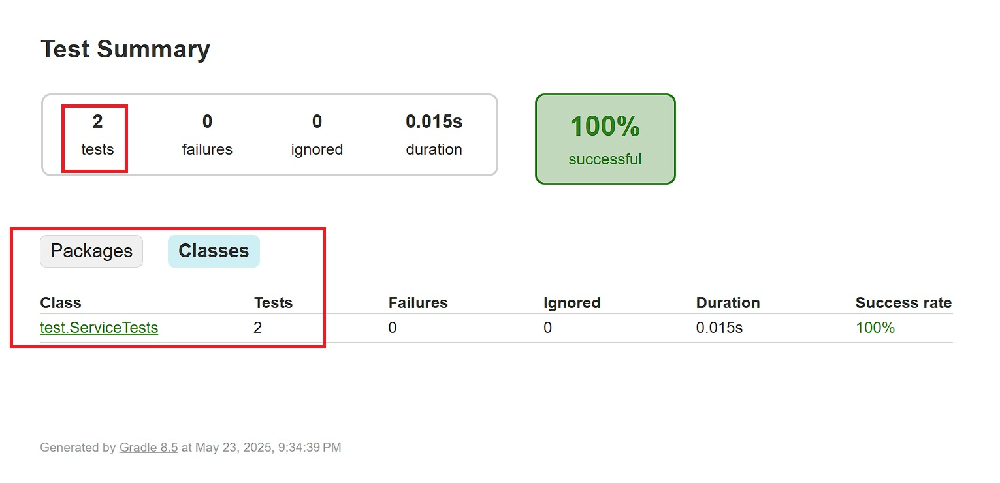
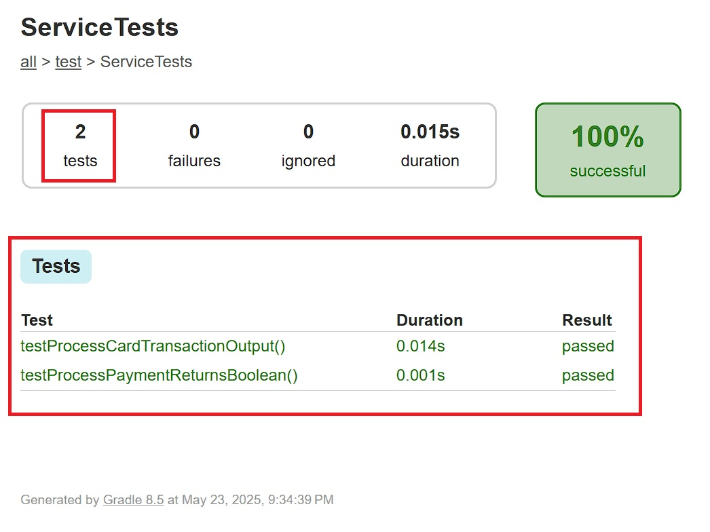

# Coffeemaker - GitHub Actions CI Pipeline ☕


A Java-based point-of-sale (POS) simulation system tailored for a coffeemaker environment. This application manages users, transactions, payment methods, and basic authentication, all built using standard Java with Gradle and JUnit for testing.

> GitHub Repository: [https://github.com/bjett4409/CSC-449-Java-NU-Spring-2025/tree/coffeemaker-ci-github](https://github.com/bjett4409/CSC-449-Java-NU-Spring-2025/tree/coffeemaker-ci-github)

---

## 📁 Project Structure

CoffeemakerProject/

```groovy
.github/
└── workflows/
    └── ci.yml
├── Screenshots/
│   ├── service-tests.jpg
│   ├── test-summary-classes.jpg
│   └── test-summary-packages.jpg
├── src/
├── main/
│   └── java/
│       ├── model/
│       │   ├── Item.java
│       │   ├── PaymentMethod.java
│       │   ├── Role.java
│       │   ├── Transaction.java
│       │   └── User.java
│       └── service/
│           ├── AuthService.java
│           ├── PaymentService.java
│           └── TransactionService.java
├── test/
│   └── java/
│       └── test/
│           └── ServiceTests.java
├── build.gradle
├── gradlew
├── gradlew.bat
├── pom.xml
├── README.md
├── settings.gradle
```

---

## ✅ Features

- **User Management** – Create and manage different user roles.
- **Payment Handling** – Support for various payment methods.
- **Transaction Service** – Record and process transactions.
- **Authentication Layer** – Simple AuthService for user validation.
- **Unit Testing** – JUnit-based test coverage with HTML report generation.

---

## 🏗️ Build & Run Locally

1. 📦 **Clone the repository**

   ```bash
   git clone https://github.com/bjett4409/CSC-449-Java-NU-Spring-2025.git
   cd CSC-449-Java-NU-Spring-2025
   git checkout coffeemaker-ci-github
   ```

2. 🛠️ **Build the project**

   ```bash
   ./gradlew build
   ```

3. 🧪 **Run tests**

   ```bash
   ./gradlew clean test
   ```

4. 📄 **View test reports**

   Open the following file in your browser:
   `build/reports/tests/test/index.html`

---

## 🧪 Testing

- All core services are unit tested using `ServiceTests.java`. Results can be found under:

```swift
build/reports/tests/test/
```

- Screenshots of the reports are available under the `Screenshots/` folder.
 Test Summary Packages
 Test

---

## 🚀 Running GitHub Actions CI

### 🔧 Setup Instructions

1. **Ensure the following files exist in your repo:**

```pgsql
.github/
└── workflows/
└── ci.yml
```

1. **Verify the Gradle wrapper is committed and accessible:**

- `gradlew`
- `gradlew.bat`
- `gradle/wrapper/gradle-wrapper.jar`
- `gradle/wrapper/gradle-wrapper.properties`

1. **Ensure `.gitignore` does not block the wrapper JAR:**

```gitignore
!gradle/wrapper/gradle-wrapper.jar
```

1. **Push your changes to the `coffeemaker` branch:**

```bash
git add .
git remote set-url origin https://github.com/YOUR_USERNAME/YOUR_REPO.git
git commit -m "Trigger GitHub Actions CI"
git branch -M coffeemaker-github-ci
git push origin coffeemaker-github-ci
```

1. **Visit the Actions tab in GitHub to monitor the build:**
<https://github.com/YOUR_USERNAME/YOUR_REPO/actions>

### 📝 GitHub Actions Workflow File (ci.yml)

```yaml
name: Java CI with Gradle

on:
  push:
    branches: [ coffeemaker-ci-github ]
  pull_request:
    branches: [ coffeemaker-ci-github ]

jobs:
  build:

    runs-on: ubuntu-latest

    steps:
    - name: Checkout code
      uses: actions/checkout@v4

    - name: Set up JDK 21
      uses: actions/setup-java@v4
      with:
        distribution: temurin
        java-version: 21

    - name: Grant execute permission for gradlew
      run: chmod +x gradlew

    - name: Run tests with Gradle
      run: ./gradlew clean test
```

### 📸 GitHub Action CI Screenshot


---

## 📷 Sample Test Reports

- Test Summary Classes

- Test Summary Packages

- Service Tests
 Service Tests

---

## 📦 Dependencies

- Java 21
- JUnit 5
- Gradle Wrapper (7.x+)
- GitHub Actions for CI (see `.github/workflows/ci.yml`)

---

## 🛠️ Troubleshooting

### 🔧 Gradle Wrapper Issues

- ❌ `gradlew: Permission denied`
  - 📌 Fix: Make the wrapper executable

    ```bash
    chmod +x gradlew
    ```

- ❌ `Could not find or load main class org.gradle.wrapper.GradleWrapperMain`
  - 📌 Cause: Missing or corrupted gradle-wrapper.jar
  - ✅ Fix: Regenerate the wrapper
  
    ```bash
    gradle wrapper --gradle-version 8.13
    ```
  
    Or download a valid `gradle-wrapper.jar` and place it in:

    ```pgsql
    gradle/wrapper/gradle-wrapper.jar
    ```

- ❌ `Error: Invalid or corrupt jarfile gradle-wrapper.jar`
  - 📌 Fix: Replace it with a fresh `.jar` from the official Gradle 8.13 distribution.

### 🔧 GitHub Actions Failures

- ❌ Unable to access jarfile gradle-wrapper.jar in CI
  - 📌 Fix: Ensure `.gitignore` does not exclude the wrapper JAR.
  
    Add exception in `.gitignore`:

    ```gitignore
    !gradle/wrapper/gradle-wrapper.jar
    ```

- ❌ Java not found or wrong version in CI
  - 📌 Fix: Ensure the workflow YAML includes:
        ```yaml
        uses: actions/setup-java@v3
        with:
          java-version: '21'
          distribution: 'temurin'
        ```

### 🔧 Build or Test Failures

- ❌ `BUILD FAILED` with no clear error
  - 📌 Fix: Run Gradle with more detail:

    ```bash
    ./gradlew build --info
    ```

- ❌ Unit tests not detected or not running
  - 📌 Fix:
    - Ensure test classes are in `src/test/java`
    - Class names must end with `Test`, e.g., `CoffeeMakerTest.java`
    - Annotate test methods with `@Test`

---

## 📝 Notes

- The project includes `.vscode` and `.vs` configurations for developer convenience.
- It supports both Gradle and Maven configurations for flexibility.

---

## 👤 Author

**Brandon Jett**  
*CSC 449 – Software Engineering*  
*National University – Spring 2025*  
GitHub: [@bjett4409](https://github.com/bjett4409)

---

## 📄 License

This project is licensed under the **MIT License**.  
See the [LICENSE.txt](LICENSE.txt) file for full details.
