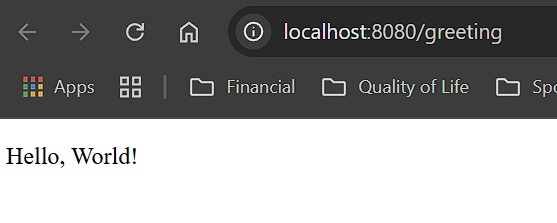
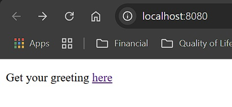

# Serving Web Content with Spring Boot


This guide walks you through the process of creating a “Hello, World” web site with Spring Boot.

---

## 🚀 What You Will Build

You’ll create an application that:

- Has a static home page at `http://localhost:8080/`
- Responds to `GET` requests at `http://localhost:8080/greeting`
- Renders "`Hello, World!`" or "`Hello, Brandon`" based on an optional `?name=` query parameter

---

## 🧰 What You Need

- Java 21+
- IntelliJ IDEA or VS Code
- Gradle or Maven
- Spring Initializr

---

## 🛠️ Getting Started with Spring Initializr

You can generate a pre-configured project here:  
👉 [https://start.spring.io](https://start.spring.io)

**Manual setup steps:**

1. Visit <https://start.spring.io>
2. Choose:
   - Project: Gradle or Maven
   - Language: Java
   - Dependencies: `Spring Web`, `Thymeleaf`, `Spring Boot DevTools`
3. Click **Generate**
4. Unzip the project

📌 Or fork the complete version from GitHub and open in your IDE.

---

## 📁 Project Folder Structure

```css
GS-SERVING-WEB-CONTENT/
├── .github/
├── .vscode/
│
├── complete/
│   ├── .gradle/
│   ├── .mvn/
│   ├── bin/
│   ├── build/
│   ├── gradle/
│   ├── src/
│   │   ├── main/
│   │   │   ├── java/com/example/servingwebcontent/
│   │   │   │   ├── GreetingController.java
│   │   │   │   └── ServingWebContentApplication.java
│   │   │   └── resources/
│   │   │       ├── static/
│   │   │       │   └── index.html
│   │   │       └── templates/
│   │   │           └── greeting.html
│   │
│   └── test/
│       └── java/com/example/servingwebcontent/
│           └── ServingWebContentApplicationTest.java
│
├── build.gradle
├── gradlew
├── gradlew.bat
├── mvnw
├── mvnw.cmd
├── pom.xml
├── settings.gradle
│
├── initial/
│   ├── .gradle/
│   ├── .mvn/
│   ├── bin/
│   ├── build/
│   ├── gradle/
│   └── src/
│       ├── main/
│       │   ├── java/com/example/servingwebcontent/
│       │   │   └── ServingWebContentApplicationTests.java
│       │   └── resources/
│       │       └── application.properties
│       └── test/
│           └── java/com/example/servingwebcontent/
│               └── ServingWebContentApplicationTest.java
│
├── Screenshots/
│   ├── Greeting User.jpg
│   ├── Greeting.jpg
│   └── index-html.jpg
│
├── .gitignore
├── LICENSE.txt
├── README.md
```

---

## 🎛️ Create `GreetingController.java`

```java
package com.example.servingwebcontent;

import org.springframework.stereotype.Controller;
import org.springframework.ui.Model;
import org.springframework.web.bind.annotation.GetMapping;
import org.springframework.web.bind.annotation.RequestParam;

@Controller
public class GreetingController {

    @GetMapping("/greeting")
    public String greeting(@RequestParam(name="name", required=false, defaultValue="World") String name, Model model) {
        model.addAttribute("name", name);
        return "greeting";
    }
}
```

---

## 🎛️ Create `ServingWebContentApplication.java`

```java
package com.example.servingwebcontent;

import org.springframework.boot.SpringApplication;
import org.springframework.boot.autoconfigure.SpringBootApplication;

@SpringBootApplication
public class ServingWebContentApplication {

    public static void main(String[] args) {
        SpringApplication.run(ServingWebContentApplication.class, args);
    }

}
```

---

## 🔍 Key Concepts

- Controller marks the class as a web controller.
- RequestParam maps the query string value.
- Model makes the value accessible in the view (HTML template).
- Thymeleaf template greeting.html will render the response.

---

## 🖼️ greeting.html (Thymeleaf View)

Create `src/main/resources/templates/greeting.html`

```html
<!DOCTYPE HTML>
<html>
<head> 
    <title>Getting Started: Serving Web Content</title> 
    <meta http-equiv="Content-Type" content="text/html; charset=UTF-8" />
</head>
<body>
    <p>Get your greeting <a href="/greeting">here</a></p>
</body>
</html>
```

✅ Make sure spring-boot-starter-thymeleaf is in your dependencies

---

## ⚡ Spring Boot DevTools

To speed up development:

- Enables hot-swapping
- Disables caching for template engines
- Supports LiveReload for browser auto-refresh

---

## ▶️ Run the Application

Spring Initializr creates a main class for you:

```java
@SpringBootApplication
public class ServingWebContentApplication {
    public static void main(String[] args) {
        SpringApplication.run(ServingWebContentApplication.class, args);
    }
}
```

Start your app:

```bash
./gradlew bootRun
```

---

## ✅ Test the Application

Open:

- <http://localhost:8080/greeting> → “Hello, World!”


- <http://localhost:8080/greeting?name=Brandon> → “Hello, Brandon!”


---

## 🏠 Add a Home Page

Spring Boot serves static content from src/main/resources/static.

Create `src/main/resources/static/index.html`

```html
<!DOCTYPE html>
<html>
  <head>
    <title>Welcome</title>
    <meta charset="UTF-8" />
  </head>
  <body>
    <h1>Hello World!</h1>
    <p><a href="/greeting">Go to /greeting</a></p>
  </body>
</html>
Now visit http://localhost:8080/
```



---

## 🧪 Run + Debug Commands

```bash
# Clone the project
git clone https://github.com/bjett4409/CSC-449-Java-NU-Spring-2025

# Navigate into the folder
cd CSC-449-Java-NU-Spring-2025

# Open in VS Code
code .

# Run the project
./gradlew bootRun
```

---

## 📚 Related Guides

- Building an Application with Spring Boot
- Testing the Web Layer
- Building a RESTful Web Service
- Accessing Data with JPA

---

## 🏁 Summary

You now have:

- A working Spring Boot app
- A static home page and a dynamic controller
- Thymeleaf integration
- DevTools-enabled live reload
